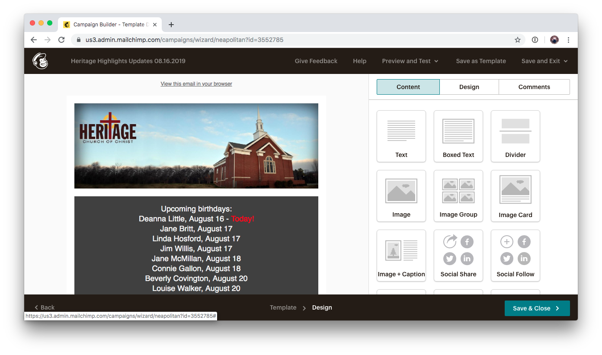

# Heritage Highlights newsletter

Heritage Highlights is the weekly newsletter that is published by the church in order to send out announcements such as upcoming birthdays/anniversaries, prayer requests, and upcoming events. We leverage [Mailchimp's](../../../../vendor-management/mailchimp.md) capabilities to create and send out the newsletter each week to our subscriber list.

## Step 1: Login to Mailchimp

Visit their [login](https://login.mailchimp.com/) page to access the control panel.


Access is currently restricted to our Secretary. Submit a [request](https://docs.google.com/forms/d/e/1FAIpQLScqt1RndHEA3udGeOoMNzDoettr30-P1vTEHm3RkEbdn_1EOQ/viewform?usp=pp_url&entry.74352180=Mailchimp) if you need access.


## Step 2: Create a new campaign

Click the "Create Campaign" button on the right side of the screen.

Then select "Email" on the right side

Enter a Campaign name in the format of "Heritage Highlights Updates MM.DD.YYYY" and push the "Begin" button.

Select "all subscribed contacts" as the audience you are emailing, ensure "Heritage Church of Christ" is shown as the sender, and title the subject in the format of "Heritage Highlights MM.DD.YYYY".

## Step 3: Modify the template for the campaign

Click the "Design Email" and then choose "Saved Templates". Locate and click the template with the most recent modification date.

Update each of the content blocks based utilizing the list of sources shown in the table below. 

| Content Block | Source |
| :--- | :--- |
| Upcoming birthdays | [PCO Birthday List](https://people.planningcenteronline.com/lists/848679) |
| Scripture of the day | [BibleGateway.com](https://www.biblegateway.com/) |
| Congratulations | Incoming Emails |
| Prayer Requests | Incoming Emails |
| Sympathy | Incoming Emails |
| Upcoming Events | [PCO Group Schedule](https://groups.planningcenteronline.com/events?group_type=&=) / [PCO Registrations](https://registrations.planningcenteronline.com/) / Incoming Emails |


Mailchimp has some [great documentation](https://mailchimp.com/help/templates/) to help modify or create design templates. 


Once all of the content blocks have been modified, hit the "Save & Close" button in the bottom right corner.

## Step 4: Send out the newsletter 

When you are ready to send the newsletter, simply hit the "Send" button in the top right corner.

