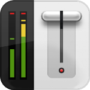
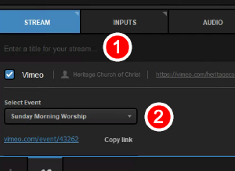
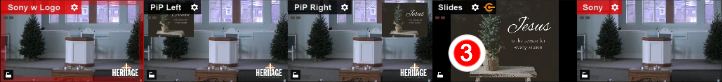
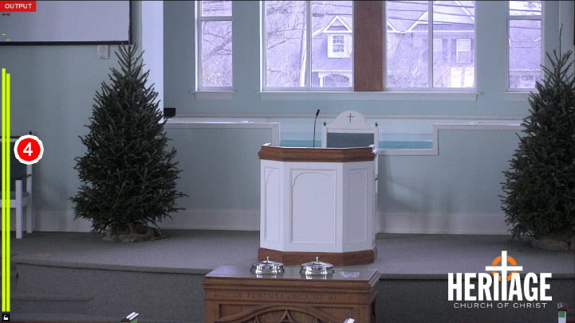

# Livestream Tasks

## Step 1: Login to Windows

* [ ] Turn on the PC if is powered off and login.

## Step 2: Open LiveStream Studio

* [ ] Double-click the LiveStream Studio icon on the Windows desktop if the application isn't currently running already.

## Step 3: Check settings for broadcast

1. [ ] Fill in the Sermon Title or Class Title in the Stream tab.
2. [ ] Choose the correct Event from the dropdrown menu

* [ ] Check that the Slides input screen reflects what is displayed on the projectors.


Skip the Slides task if the auditorium camera is all that will be broadcast.


* [ ] Check that audio level bars are present within the Program screen

## Step 4: Begin the stream

* [ ] Press the "Go Live" button in the bottom right corner


If you receive an error when pressing the button to stream the service, wait 10 seconds and press the "Go Live" button again.



Attempt this process at least 5 times before reaching out to Joseph during a service.


## 

