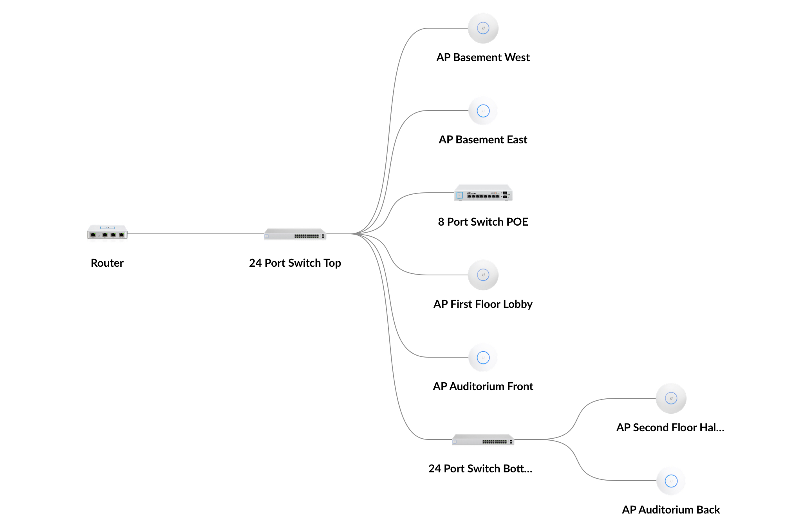

# Topology

The network is composed completely of Ubiquiti hardware.

## Topology Map

## Device list

| Devices | Model | Count |
| :--- | :--- | :--- |
| [UniFi Security Gateway](../hardware/electrical-room/unifi-security-gateway.md) | USG | 1 |
| [UniFi Switch PoE 24](../hardware/electrical-room/unifi-switch-poe-24.md) | US‑24‑250W | 2 |
| [UniFi Cloud Key Gen2 Plus](../hardware/electrical-room/unifi-cloud-key-gen2-plus.md) | UCK-G2-PLUS | 1 |
| [UniFi Switch 8-150W](../hardware/crows-nest/unifi-switch-8-150w.md) | US‑8‑150W | 1 |
| UniFi AP nanoHD | UAP-nanoHD | 3 |
| UniFi AP AC Pro | UAP‑AC‑PRO | 3 |

