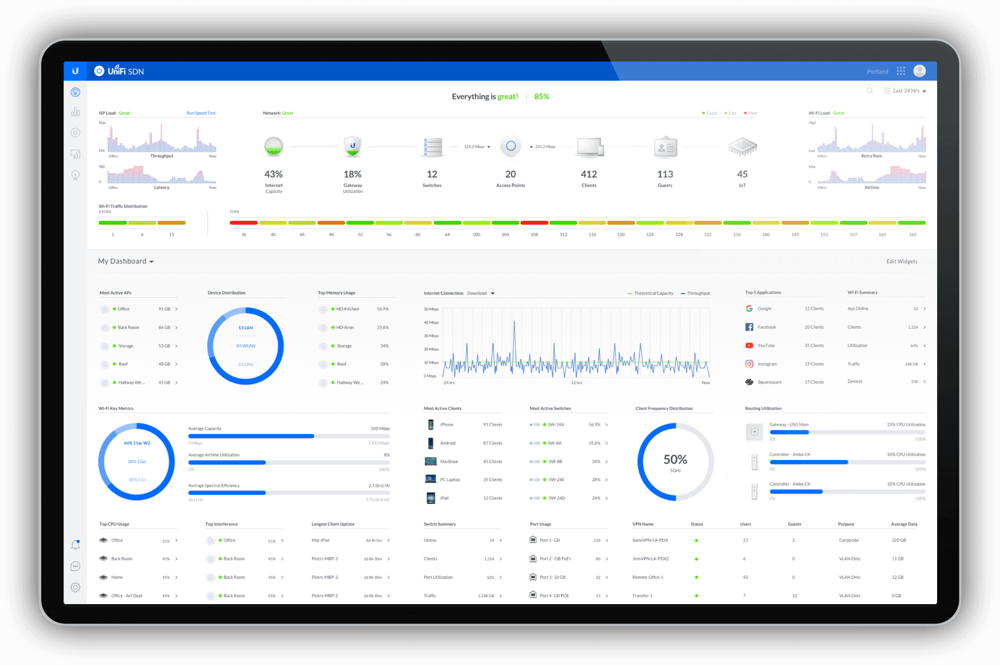

# UniFi SDN

The network can be modified by utilizing the onsite [UniFi Cloud Key Gen2 Pro](../../hardware/electrical-room/unifi-cloud-key-gen2-plus.md) which runs the SDN Controller software. It can be accessed with either the [mobile application](https://itunes.apple.com/us/app/unifi/id1057750338?mt=8) or the [web interface](https://192.168.1.91:8443) if you are located onsite and on a non-guest network.

In order to access the administration pages referenced above, an administrator account must be created. Submit a [request](https://docs.google.com/forms/d/e/1FAIpQLScqt1RndHEA3udGeOoMNzDoettr30-P1vTEHm3RkEbdn_1EOQ/viewform?usp=pp_url&entry.74352180=UniFi+SDN) if you need an account.

 

